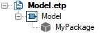
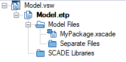

.. py:currentmodule:: ansys.scade.apitools

Create SCADE models
===================

With the SCADE Python API, you can modify SCADE projects and models. However, creating consistent instances
of classes and associations requires a deep knowledge of the underlying meta-model. Mistakes can lead to
corrupted models, which are difficult to detect, and to tool crashes.

The :py:mod:`create <ansys.scade.apitools.create>` module provides higher-level functions to ensure the
syntactically correctness of the created models. The overall design consists in having independent functions,
meaning that you do not have to make several function calls to complete a single modification.

.. important::
  You must only use the SCADE Python API in command-line scripts. Modifying a model from the IDE
  while it is loaded corrupts the internal state of the SCADE Editor and leads to unpredictable results.

Usage notes
-----------

  * The current version only supports creating elements in an existing project or SCADE model. The edition
    of a model, for example deleting elements, requires more functions that might be added later.
  * Annotations are not supported yet.
  * The SCADE Python API is derived from the existing *SCADE Creation Library* (*SCL*), available for TCL and Python.

    * Functions have been renamed accordingly to PEP8.
    * While most of the interfaces are identical, there are a few changes for providing more Pythonics way of
      accomplishing tasks.
    * You can migrate existing applications to use the SCADE Python API or continue to use *SCL*, which is
      to be re-implemented on top of the SCADE Python API.

  * The functions are all accessible from :py:mod:`create <ansys.scade.apitools.create>`, regardless the submodule they are defined in.

Script architecture
-------------------

A script that modifies a SCADE model usually has the following architecture:

* Load an existing project: This gives access to two separate sets of data:

  * Project: Content of the project (ETP) file.
  * SCADE model: Content of the model (XSCADE and SCADE) files.

* Add new elements to the project and the model.
* Save the project and the model.

This script adds a new package to a project:

.. code:: python

  """
  Example for creating a package.

  scade.exe -script <project> create_package.py
  """

  from pathlib import Path

  from scade.model.suite import get_roots as get_sessions
  from scade.model.project.stdproject import get_roots as get_projects

  import ansys.scade.apitools.create as create

  def main():
      project = get_projects()[0]
      session = get_sessions()[0]

      # create a package in the project's directory
      path = Path(project.pathname).parent / 'MyPackage.xscade'
      package = create.create_package(session.model, 'MyPackage', path)
      # save the Scade model
      create.save_all()

      # add the package to the project file
      create.add_element_to_project(project, package)
      # save the project file
      create.save_project(project)

  if __name__ == '__main__':
      main()

When run on an empty project, the new Scade model is as follows:

The new file is added to the project at the default location:

Debugging of a creation script
------------------------------

To ease debugging, you should embed the script in an environment that first makes a copy of
the original model.

The following script, compatible with any Python IDE, makes a copy of the original model, declares
the result project, and calls the original script's ``main`` function:

.. code:: python

  """
  Wrapper of create_package.py for debugging.

  Project: ./Model/Model.etp
  """

  from pathlib import Path
  from shutil import rmtree, copytree

  from ansys.scade.apitools import declare_project

  from create_package import main

  # duplicate the model to a new directory
  dir = Path(__file__).parent
  source_dir = dir / 'Model'
  target_dir = dir / 'Result'
  if target_dir.exists():
      rmtree(target_dir)
  copytree(source_dir, target_dir)

  # declare the duplicated model
  declare_project(str(target_dir / 'Model.etp'))

  # regular script
  main()

Trees
-----

The library does not support the creation of intermediate elements, which eliminates the risk of
incorrect models because of partial or missing links.
For example, it is not possible to create an instance of ``ExprId`` linked to a constant
but not contained by any model element.
Some parts, such as types or expressions, can be quite large. You can use functions for creating
such trees in an incremental way, which are compiled when creating the related model
element. These intermediate structures, or trees, are used for creating:

* Types
* Expressions
* Transitions
* Control block branches

Type tree (TT)
^^^^^^^^^^^^^^

A :py:class:`TypeTree (TT) <create.type.TypeTree>` instance represents any SCADE type.
:py:class:`Extended type trees (EX) <create.type.TX>` provide more flexibility by
accepting any of the following types:

* :py:class:`TypeTree (TT) <create.type.TypeTree>` instance
* ``scade.model.suite.Type`` instance
* Name of a predefined type, such as ``'bool'``, ``'int32'``, and ``'float64'``

There are functions to create complex expression trees, such as structures or arrays, cf.
:py:mod:`create.type <ansys.scade.apitools.create.type>`.

This example adds a simple type to a model:

.. code:: python

    # add a new type to the model, in the default file for root declarations
    speed = create.create_named_type(model, 'Speed', 'float32', path=None)

This next example creates an array of points:

.. code:: python

    # add an array of points
    tree = create.create_structure(('x', 'float32'), ('y', 'float32'))
    point = create.create_named_type(model, 'Point', tree)
    tree = create.create_table(9, point)
    polyline = create.create_named_type(model, 'polyline', tree)

Although not advised, combining type trees is possible:

.. code:: python

    # add an array of anonymous (x, y)
    tree_struct = create.create_structure(('x', 'float32'), ('y', 'float32'))
    tree_table = create.create_table(9, tree_struct)
    polyline2 = create.create_named_type(model, 'polyline2', tree_table)

For comprehensive information on functions for creating any type of tree, see
:py:mod:`create.type <ansys.scade.apitools.create.type>` in the API reference
documentation.

..
  :py:func:`create.declaration.create_named_type`

Expression tree (ET)
^^^^^^^^^^^^^^^^^^^^

An :py:class:`ExpressionTree <create.expression.ExpressionTree>` instance represents
any SCADE expression made of operators and operands. To create an extended expression
(EX) tree, you an use the :py:meth:`create.expression.EX` method. It provide more
flexibility by accepting any of these types:

* :py:class:`ExpressionTree (ET) <create.expression.ExpressionTree>` instance
* ``scade.model.suite.ConstVar`` instance
* Scade literal, such as ``'true'`` and ``'3.14_f32'``
* Python literal, such as ``True``, ``42``, ``3.14``, and ``'c'``

The following example adds two constants to a model. The first one, ``N``, is an
integer, and its expression is the literal ``42``. The second one, ``N2``, requires
an expression tree to specify its value.

.. code:: python

    # constant N: int32 = 42
    cst_n = create.create_constant(model, 'N', 'int32', 42)
    # constant N2: int32 = N * N
    tree = create.create_nary('*', cst_n, cst_n)
    cst_n2 = create.create_constant(model, 'N2', 'int32', tree)

For comprehensive information on functions for creating an expression tree, see
:py:mod:`create.expression <ansys.scade.apitools.create.expression>` in the API
reference documentation.
